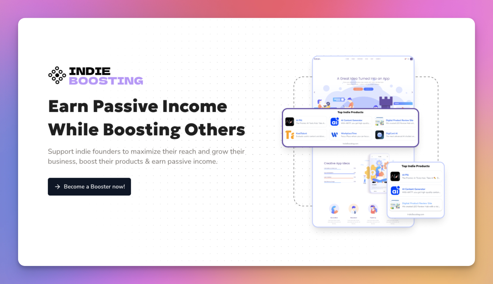
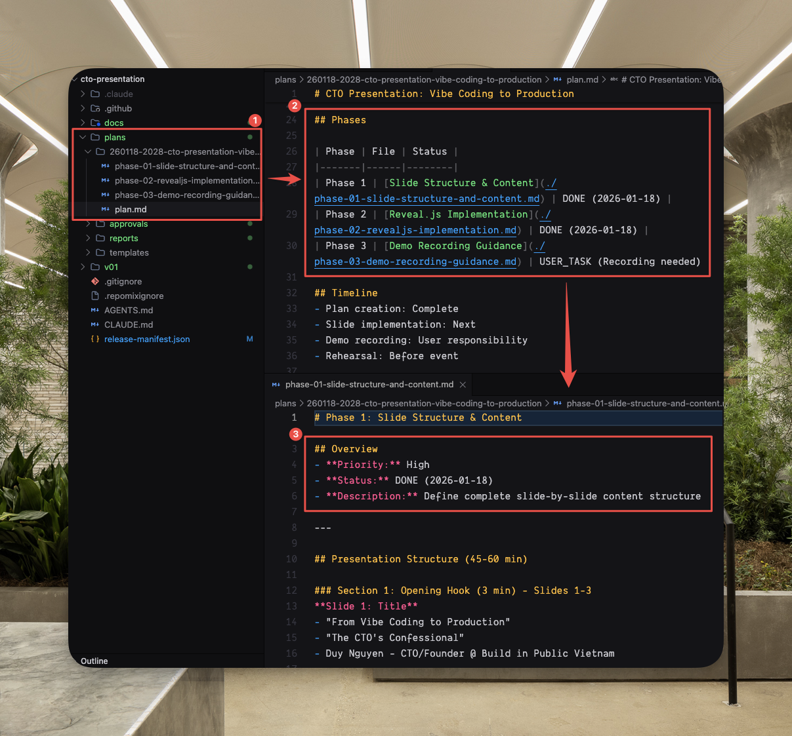

# Feedback 01
(*) S = Slide

## General

## Slides

- [x] S01:
  - "// THE CTO'S CONFESSIONAL" -> make sure it fit in 1 row.
  - "$ whoami | Duy Nguyen | CTO @ Build in Public Vietnam" -> make sure it fit in 1 row.
- [x] S05: use 
- [x] S08: make the title fit in 1 row
- [x] S12: revise the content to:
  - "LIE #02: LARGE CONTEXT WINDOW IS GOOD"
  - "Question: Gemini 3 (1M tokens) vs Opus 4.5 (200K tokens) - Which is better?"
- [x] S13: "CONTEXT ROT IS REAL"
  - "Answer: Opus 4.5"
  - "Why?"
  - "After 100-150k tokens, models get hallucinated."
  - "According to these researches..."
- [x] S14.03:
  - Title: "HOW TO FIX?"
  - Remove 3 cards: GPT, Claude, Quality
  - Add: "Context Engineering is the key"
- [x] S15:
  - Make "FATAL: assumption !== understanding" fit in 1 row
- [x] S18:
  - "[The question every CTO should ask]" -> make sure it fit in 1 row.
  - Add: "(And many overthinkers also ask 😁)"
- [x] S19:
  - Change: "DAY 6" -> "MONTH 5"
  - Add: "I built this product in 2 weeks with Windsurf, 100% vibe coding."
- [x] S20.01:
  - Fix: text got cut off at the bottom.
  - Add: "🥲 Raw SQL query -> insecure."
- [x] S21:
  - Make "No caching • No rate limiting • No CDN" fit in 1 row
- [x] S22: Revise "[OUT OF MEMORY] Server crashed every 4 hours"
- [x] S23:
  - Add: "The whole code base is a mess"
- [x] S25:
  - Add: "Again: only when your product is validated."
- [x] S28.03:
  - Fix: text got cut off in 3 cards.
  - Remove "DEMO" box.
  - Add: "Spec-Driven Development. Everything is reviewable & trackable."
- [x] S29.01:
  - Add: "This is also helpful for human, e.g. onboarding new team members."
- [x] S30.02:
  - Fix: text got cut off in 2nd card.
  - Add: "Reveal unresolve questions & different perspectives."
  - Remove demo box.
  - Add: "Plus: you're building a context for the next steps."
- [x] S31.03:
  - Use  for the demo of `/plan` command
  - Fit the layout into 16:9 aspect ratio.
- [x] S33:
  - Add "WRITE TESTS" step that parallelize with "WRITE CODE" step
  - Visualize: if something's broken in every step, repeat the process.
  - Add: "Test-Driven Development"
- [x] S34.02:
  - Fix: lay 3 cards out in 3 columns
  - Make sure text inside each card is not cut off.
- [x] S35: remove this slide
- [x] S36:
  - Fix: text inside cards got cut off.
- [x] S37:
  - Fix: all rows should fit in 1 line (do not let them wrapped)
- [x] S38:
  - Change text "DEMO" to "MVP"
- [x] S39:
  - Replace "THE COST OF NOT DOING THIS" with "I couldn't do this last year because the models are stupid"
  - Replace "DON'T KILL YOURS." with "Now - with Opus 4.5 - it's possible."
- [x] S40:
  - Add: "1 min for advertising"
  - Add: "ClaudeKit is being trusted by 3K+ engineers across 109 countries after 3 months."
  - Add: "These slides was 100% generated by ClaudeKit."
  - Add: "$99 once. Life time updates."
  - Add: "AIBUILDERSVN - 50% off - only 50 seats - expired in 3 days."
- [x] S41:
  - Add: "Join 60K+ solo-builders in Vietnam."
- [x] S42:
  - Add X link to "@goon_nguyen"
